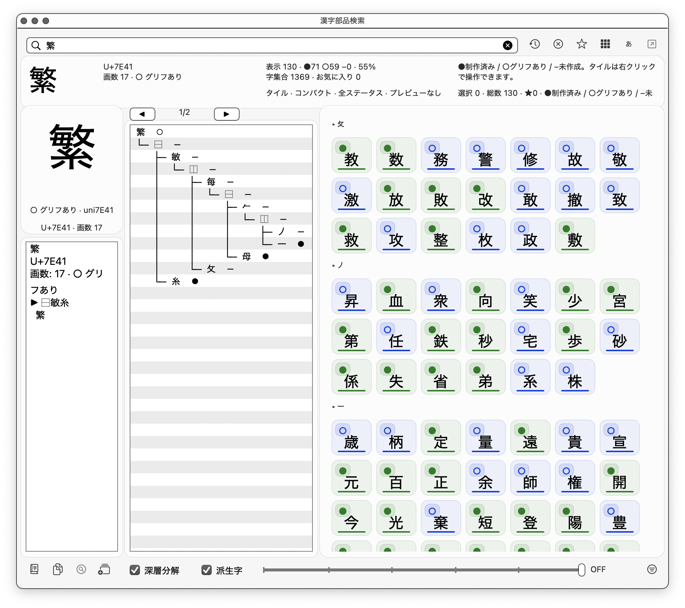

[繁體中文](#漢字-ids-部件查詢) | [English](#hanzi-ids-component-explorer)

---

# 漢字 IDS 部件查詢

[Glyphs](https://glyphsapp.com/) 字型編輯器外掛，用於拆解漢字結構並查詢相關字符。

  

## 功能

- **字符拆解** — 輸入漢字，視覺化顯示其部件樹狀結構
- **多部件組合搜尋** — 輸入多個部件（如「氵木」）找出同時包含所有部件的字；採遞迴比對（部件藏在更深層也算，如「淋」含「木」），重複部件代表「至少 N 個」（如「木木」找含兩個以上木的字）
- **同字根查詢** — 找出與本字結構相同的關聯字
- **衍生字查詢** — 找出以本字為部件的衍生字
- **字集篩選** — 預設顯示字型檔內的字，亦可使用自訂字集
- **顏色篩選** — 依 Glyphs 顏色標籤過濾結果
- **筆畫數篩選** — 用底部滑桿選擇 ±0/±1/±2/±3/±5 筆畫差，快速從相關字中找到筆畫接近主字的造字參考（資料源自 CNS11643）
- **全字庫連結** — 一鍵查詢 CNS11643 全字庫資料

## 安裝

### 外掛程式管理員（推薦）

1. *視窗 > 外掛程式管理員*
2. 搜尋「HanziIDSComponentExplorer」
3. 點擊 *安裝*
4. 重新啟動 Glyphs

### 手動安裝

下載 `HanziIDSComponentExplorer.glyphsPlugin`，雙擊安裝。

## 使用方式

1. *視窗 > 漢字 IDS 部件查詢* 開啟視窗
2. 在搜尋欄輸入漢字（如「森」）或 Unicode（如「68EE」）
3. 查看拆解結果、同字根、衍生字
4. 輸入多個部件（如「氵木」）搜尋同時包含所有部件的字：中欄列出輸入部件、右欄列出符合的字；此時筆畫篩選以各部件筆畫加總為基準（如「氵木」= 7 畫）

## 系統需求

- Glyphs 3.0 或以上
- macOS 10.9 或以上

## 資料來源

- **IDS 拆解資料** — [CHISE IDS database](https://www.chise.org/ids/) 的 CNS 及 Unicode 資料，收錄超過 10 萬個字符
- **筆畫數資料** — [CNS11643-OpenData](https://github.com/yintzuyuan/CNS11643-OpenData) 的 `Tables/Properties/CNS_stroke.txt`，覆蓋約 7.7 萬字（74.8%）。超出 CNS 範圍的 Ext-G/H 罕字筆畫為空，僅在「關閉筆畫篩選」時顯示

## 授權

程式碼以 [Apache License 2.0](LICENSE) 授權。

本外掛內含的 `ids.pdata` 為 [CHISE IDS](https://www.chise.org/ids/) 衍生資料，受 [GPL-2.0-or-later](LICENSES/GPL-2.0-or-later.txt) 約束。CNS11643 資料依[政府資料開放授權條款](https://data.gov.tw/license)使用。

詳見 [NOTICE](NOTICE)。

## 作者

**殷慈遠 TzuYuan Yin** — [erikyin.net](https://erikyin.net)

## 致謝

- [CHISE Project](https://www.chise.org/) — IDS 資料庫
- [全字庫](https://www.cns11643.gov.tw/) — 字形資料參考
- [3type/EOD 拆字小組](https://github.com/3type/EOD) — 資料格式啟發

---

# Hanzi IDS Component Explorer

A [Glyphs](https://glyphsapp.com/) font editor plugin for decomposing Chinese characters and exploring related glyphs.

  

## Features

- **Character Decomposition** — Visualize the component tree structure of any Chinese character
- **Multi-Component Search** — Enter multiple components (e.g. "氵木") to find characters containing all of them; uses recursive matching (a component nested deeper still counts, e.g. "淋" contains "木"), and repeated components mean "at least N" (e.g. "木木" finds characters with two or more 木)
- **Sister Characters** — Find characters sharing the same structure
- **Derived Characters** — Find characters using this character as a component
- **Charset Filtering** — Filter by current font glyphs or custom charset
- **Color Filtering** — Filter by Glyphs color labels
- **Stroke Count Filtering** — Discrete bottom slider (±0/±1/±2/±3/±5) to narrow related characters by stroke count difference from the current character (data from CNS11643)
- **CNS Link** — Quick lookup in CNS11643 database

## Installation

### Plugin Manager (Recommended)

1. *Window > Plugin Manager*
2. Search for "HanziIDSComponentExplorer"
3. Click *Install*
4. Restart Glyphs

### Manual Installation

Download `HanziIDSComponentExplorer.glyphsPlugin` and double-click to install.

## Usage

1. Open *Window > HanziIDSComponentExplorer*
2. Enter a Chinese character (e.g., "森") or Unicode (e.g., "68EE")
3. View decomposition, sister characters, and derived characters
4. Enter multiple components (e.g. "氵木") to find characters containing all of them: the middle column lists the input components, the right column lists the matches; stroke filtering then uses the sum of the components' stroke counts as the baseline (e.g. "氵木" = 7 strokes)

## Requirements

- Glyphs 3.0+
- macOS 10.9+

## Data Sources

- **IDS decomposition** — [CHISE IDS database](https://www.chise.org/ids/) (CNS and Unicode), covering over 100,000 characters
- **Stroke counts** — `Tables/Properties/CNS_stroke.txt` from [CNS11643-OpenData](https://github.com/yintzuyuan/CNS11643-OpenData), covering ~77k characters (74.8%). Characters outside CNS11643 (Ext-G/H rare ideographs) have no stroke data and are only shown when stroke filtering is OFF

## License

Source code is licensed under [Apache License 2.0](LICENSE).

The bundled `ids.pdata` is derived from the [CHISE IDS](https://www.chise.org/ids/) database and is subject to [GPL-2.0-or-later](LICENSES/GPL-2.0-or-later.txt). CNS11643 data is used under the [Open Government Data License, Taiwan](https://data.gov.tw/license).

See [NOTICE](NOTICE) for details.

## Author

**TzuYuan Yin** — [erikyin.net](https://erikyin.net)

## Acknowledgments

- [CHISE Project](https://www.chise.org/) — IDS database
- [CNS11643 全字庫](https://www.cns11643.gov.tw/) — Glyph data reference
- [3type/EOD](https://github.com/3type/EOD) — Data format inspiration

---

Copyright 2026 TzuYuan Yin
